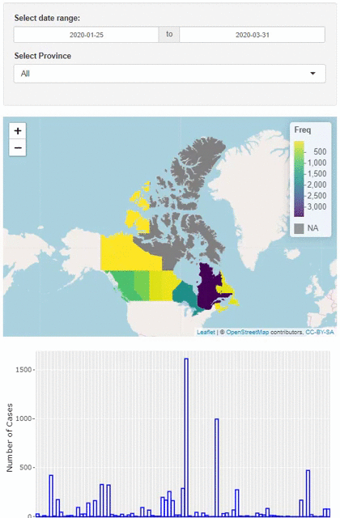

# Comparing Daily Covid-19 Cases Between Countries
## [The Dashboard](https://shafquat.shinyapps.io/Canada_Covid/)

This project used R to transform the [ViriHealth dataset](https://virihealth.com/full-details/).

We performed the following analysis in the [R File](https://github.com/Shafquat/canada_covid/blob/master/app.R):
* Scrape live data from wirihealth's website
* Cleaned the date field into a proper date format
* Grouped the data by province
* Created a Shiny application that includes:
	* Leaflet map that shows total cases by province
	* Plotly bar chart that shows total cases by Health Region
	* Data Table for sortable raw data

The goal is to analyze how Canada is tracking the Covid-19 crisis.

## Data Sources: 

[ViriHealth dataset](https://virihealth.com/full-details/)

### Prerequisites

R and R Studio are required to run this application locally.
The following packages were used in this application:
* shiny
* rvest
* DT
* leaflet
* geojsonio
* tigris
* ggplot2
* plotly

You can find an online version of the work on [ShinyApps](https://shafquat.shinyapps.io/Canada_Covid/).

## Authors

* **Shafquat Arefeen** - [Shafquat Arefeen](https://shafquatarefeen.com)
